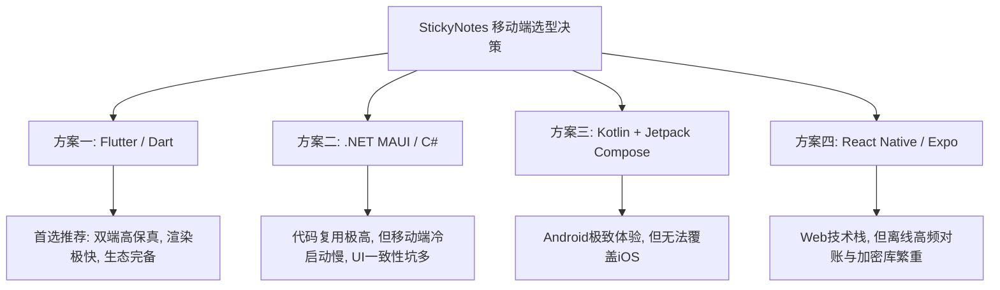
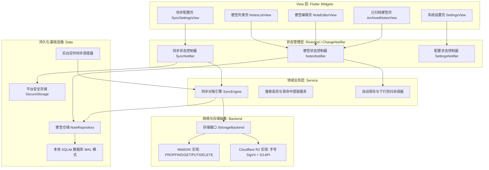
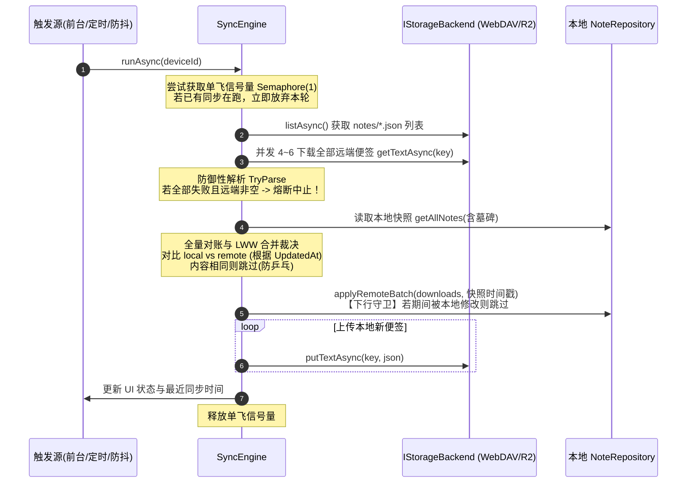

# StickyNotes 移动端 / 跨平台 App 架构与实现方案 (GFH)

> **文档版本**：v1.0.0  
> **文档代号**：`GFH`  
> **创建日期**：2026-10-04 (GMT+8)  
> **关联项目**：原桌面端 [`StickyNotesDesktop`](file:///C:/Home/Projects/StickyNotesDesktop)  
> **核心协议**：[`SYNC-PROTOCOL-DESIGN-20261004.md`](file:///C:/Home/Projects/StickyNotesDesktop/docs/SYNC-PROTOCOL-DESIGN-20261004.md)  
> **视觉参考**：[`StickyNotesDesktop/temp/screenshots/`](file:///C:/Home/Projects/StickyNotesDesktop/temp/screenshots)  

---

## 一、项目背景与定位

### 1.1 业务诉求
原桌面端项目 `StickyNotesDesktop` 是一款面向 Windows 10/11 的极简、纯离线、高可靠的彩色桌面便签软件，目前已成功落地并验证了**便签网络同步协议 v1**（基于 WebDAV 与 Cloudflare R2 / S3 兼容双存储后端，采用文件即协议与无状态全量对账架构）。

本项目为 StickyNotes 的**移动版 / 跨平台版**，旨在让用户在手机或平板移动设备上随手记录灵感与待办，并能与桌面端实现**双向无缝、数据零丢失的便签同步**。

### 1.2 功能裁剪与边界定义（移动端视角的克制）
移动端应用**不需要**照搬桌面端的全部桌面特化属性，而是针对触屏手势和移动场景进行克制裁剪：

| 功能模块 | 移动端处理策略 | 裁剪/保留理由 |
|---|---|---|
| **便签列表管理（主界面）** | **必须保留** | 核心浏览与检索入口。支持卡片流/网格展示、便签标题与预览、置顶过滤、实时搜索、新建、归档。 |
| **便签详情与编辑页** | **必须保留** | 核心创作场景。纯文本流畅输入、7 种经典主题色彩切换、置顶状态切换、软删除（归档）、字数统计与同步状态指示。 |
| **设置与同步设置** | **必须保留** | 核心配置项。支持主题切换（浅色/深色/跟随系统）、字号调整；同步设置完整保留桌面端能力（后端选型、服务器地址/凭据、测试连接、立即同步、状态统计）。 |
| **已归档便签箱** | **保留** | 方便用户查看已删除便签、恢复误删便签或清空回收站。 |
| **独立桌面悬浮贴纸** | **明确排除** | 移动端受限于移动操作系统沙盒与窗口机制，无法随处悬浮置顶，采用标准移动页导航与卡片流。 |
| **无边框窗口八向拖拽缩放** | **明确排除** | 纯桌面键鼠交互属性。 |
| **屏幕绝对坐标记忆 (X/Y/W/H)** | **忽略但不破坏** | 移动端不感知窗口坐标；协议下行时保持本地默认落点，上行时原样携带（或不修改），避免冲掉桌面端的排版。 |
| **桌面系统托盘 / 全局热键** | **明确排除** | 移动端无托盘与全局按键机制。 |
| **开机自启 / 开机最小化** | **明确排除** | 移动端对应系统级的后台任务调度。 |

---

## 二、数据契约与协议规范对齐

为了保证与桌面端无缝协同，移动端必须 100% 遵照桌面端已落地的协议设计与数据模型规范。

### 2.1 经典 7 色主题色板规范
移动端在视觉上必须与桌面端完全一致，保持柔和、护眼且高辨识度的卡片质感：

| 主题色枚举 (`color`) | 背景色 (`Background`) | 标题/工具条 (`Toolbar`) | 文本色 (`Text`) | 边框色 (`Border`) | 强调色 (`Accent`) | 次级文本 (`Secondary`) |
|:---|:---:|:---:|:---:|:---:|:---:|:---:|
| **`yellow`** (默认) | `#FFF7D1` | `#FFEE9D` | `#202020` | `#E6D77D` | `#E0A800` | `#6C6546` |
| **`green`** | `#E4F9E0` | `#C8F2C2` | `#202020` | `#BCE5B6` | `#209E35` | `#476A42` |
| **`pink`** | `#FFE4EF` | `#FFC7DE` | `#202020` | `#F5BCCE` | `#DB3374` | `#774457` |
| **`purple`** | `#F2E6FF` | `#E4CCFF` | `#202020` | `#D5BAFA` | `#7F3CD8` | `#594575` |
| **`blue`** | `#E1F3FE` | `#C3E8FD` | `#202020` | `#B7DAF5` | `#1079D1` | `#425C70` |
| **`gray`** | `#F6F6F8` | `#E8E8EB` | `#202020` | `#DCDCE0` | `#636366` | `#616166` |
| **`charcoal`** (暗黑) | `#292929` | `#1E1E1E` | `#F5F5F5` | `#3D3D3D` | `#4CC2FF` | `#A6A6A6` |

### 2.2 便签文件 Wire 格式 (JSON Schema v1)
远端对象统一为 `<根>/notes/<小写Guid>.json`，单文件 UTF-8 无 BOM，格式严格如下：

```json
{
  "schemaVersion": 1,
  "id": "9f3c8a4e-1b2d-4c3e-a5f6-0123456789ab",
  "content": "便签正文（纯文本，\\n 换行）",
  "color": "yellow",
  "isPinnedInList": false,
  "alwaysOnTop": false,
  "isDeleted": false,
  "createdAt": "2026-10-04T03:00:00.0000000Z",
  "updatedAt": "2026-10-04T07:30:00.0000000Z",
  "deviceId": "android-a7b3cd"
}
```

### 2.3 移动端必须严格遵照的 8 大同步铁律
1. **换行符规范化**：DTO 序列化与比对时，所有换行符统一规范化为 `\n`（禁止出现 `\r\n` 导致的虚假内容差异与死循环推送）。
2. **时间戳精度与格式**：全链路采用 ISO-8601 UTC round-trip 格式（含 `.0000000Z`），禁止把无时区时间戳解释为本地时间。
3. **LWW 裁决规则**：`local.UpdatedAt >= remote.UpdatedAt` 时本地胜出（相等且内容不同时本地胜出）。
4. **防乒乓传输**：仅当业务内容（`Content`, `Color`, `IsPinnedInList`, `AlwaysOnTop`, `IsDeleted`）与远端存在实际差异时才执行 PUT。
5. **时间戳不回填**：若两端内容相同但时间戳不同，两端均不执行传输，各自保留本地时间戳。
6. **下行写守卫（Guard）**：下行入库必须采用单事务条件更新，仅覆盖“读取快照后未被本地修改”的便签；若快照后被本地编辑则跳过下行，下一轮自动重算。
7. **全失败熔断防护**：远端列表非空但所有 GET 均失败时，**绝不允许**当作远端为空而执行清空或覆盖回传，必须立即中止本轮。
8. **凭据安全与隐私**：密码与密钥不得明文落盘，必须经由操作系统级安全硬件保护（Android Keystore / iOS Keychain）；同步日志绝对禁止打印便签正文。

---

## 三、跨平台与移动端候选技术方案对比

针对移动端实现，我们评估了四种主流架构路线，详细分析各自优缺点与适用场景：



### 3.1 方案一：Flutter (Dart) —— 【首选推荐方案】
- **技术栈**：Flutter 3.x + Dart 3.x
- **本地存储**：`drift`（基于 SQLite 的强类型响应式框架）或直接使用底层 `sqlite3`
- **网络与加密**：官方 `http` 库处理 WebDAV；依赖 `crypto` 包手写最小 SigV4 签名器（100 行内代码）
- **安全存储**：`flutter_secure_storage`（集成 Android Keystore 与 iOS Keychain）
- **后台任务**：`workmanager`（Android WorkManager + iOS Background Fetch）

#### 优点：
1. **全平台像素级高保真**：基于 Impeller / Skia 自绘引擎，完全摆脱系统原生控件渲染差异。StickyNotes 的 7 色卡片质感、圆角、精致边框和主题阴影，在 Android 各个版本和 iPhone 上能做到 100% 像素级一致。
2. **多端覆盖能力强**：一套 Dart 代码可同时构建 Android APK、iOS App，未来如有需要还可直接无缝输出 Web 预览版或 macOS/Linux 客户端。
3. **性能优异、流畅丝滑**：Dart AOT 编译为机器码，冷启动速度通常在 200~300ms 以内，UI 始终保持稳定 60/120fps，内存占用适中（通常 50~70MB）。
4. **轻量无依赖实现 SigV4 与 WebDAV**：Dart 标准库生态极其适合写底层网络协议与流处理，无需引入庞大 AWS SDK，打出的安装包干净纯粹。
5. **对文本输入与搜索高亮支持极其成熟**：`TextField`、`TextEditingController` 以及文本高亮 spans 原生支持极其完善。

#### 缺点：
1. 空包体积底线约 15MB~20MB（由于自带自绘引擎运行时）。
2. 在极少数国内深度定制 Android ROM 上，后台 15 分钟定时同步可能会被系统杀后台，需引导用户配置省电白名单（但此点对所有非系统应用均成立）。

---

### 3.2 方案二：.NET MAUI (C#) —— 【代码资产最大复用方案】
- **技术栈**：.NET MAUI (.NET 8 / .NET 9) + C#
- **本地存储**：`Microsoft.Data.Sqlite`（直接复用桌面端 `NoteRepository` 85% 代码）
- **网络与同步**：**100% 原样直接复用原桌面项目的 `StickyNotes.Sync` 源码**（`SyncEngine.cs`, `WebDavBackend.cs`, `S3Backend.cs`, `SigV4Signer.cs`, `SyncModels.cs` 等）。
- **安全存储**：MAUI 原生 `SecureStorage`

#### 优点：
1. **不可思议的核心逻辑复用率**：原桌面端已验证完毕、通过数十个单测的 `SyncEngine`、SigV4 签名器、WebDAV 客户端、DTO 序列化和单元测试用例**无需重写一行代码**，直接引用或软链接即可，协议零漂移风险降为绝对的 0。
2. **开发门槛低**：已有桌面项目的 C# 工程师无需学习 Dart 或 Kotlin，一人统一维护两端。
3. **强类型一致**：C# 的 `DateTime` UTC round-trip 与 JSON 序列化在桌面端和移动端完全同源，无任何跨语言类型转换的隐形坑。

#### 缺点：
1. **冷启动与运行性能欠佳**：MAUI 在 Android 上的冷启动时间较长（往往在 1.5s ~ 2.5s 以上，初次加载体验偏厚重）。
2. **UI 跨平台一致性踩坑多**：MAUI 是原生控件包裹模式，圆角、边框投影在不同 Android 厂商系统（MIUI、OriginOS、EMUI）上经常出现边框粗细不一、偶发渲染裁剪等 Layout 测量 Bug。
3. **移动端生态活跃度一般**：在移动端如果遇到特定机型或系统特性的坑，社区现成案例相对 Flutter 较少。

---

### 3.3 方案三：Android 原生 (Kotlin + Jetpack Compose) —— 【单平台极致体验方案】
- **技术栈**：Kotlin + Jetpack Compose + Material 3
- **本地存储**：`Room`（Android 官方推荐 SQLite 方案）
- **网络与同步**：`OkHttp` + `kotlinx.serialization` + 手写 SigV4 签名
- **安全存储**：`EncryptedSharedPreferences` / Jetpack Security
- **后台同步**：原生 `WorkManager`（系统级优先级最高）

#### 优点：
1. **极致轻量与启动速度**：无跨平台引擎开销，APK 体积极小（通常 5MB~8MB），冷启动毫秒级（100ms 左右），系统内存占用极低（30MB 左右）。
2. **Android 系统整合度最高**：与 Android 系统的手势、暗黑模式切换、软键盘弹起联动自然流畅，WorkManager 后台保活成功率在 Android 体系内最高。
3. **符合原协议前瞻规划**：桌面端文档 §9 本身就是以 Kotlin / Room / OkHttp 为蓝本规划的。

#### 缺点：
1. **平台局限性致命**：**无法覆盖 iOS 用户**。若未来需要支持 iPhone 或 iPad，必须使用 Swift / SwiftUI 将整个 UI 和同步协议再开发一遍，成本成倍增加。
2. **需用 Kotlin 全量重写协议层**：虽然逻辑清晰，但 SigV4 签名、WebDAV multistatus XML 解析、LWW 对账仍需重新编写并调试验证。

---

### 3.4 方案四：React Native / Expo (TypeScript)
- **技术栈**：React Native (Expo), TypeScript, `expo-sqlite`
- **优点**：Web 前端开发者友好，UI 组件库丰富。
- **缺点**：
  1. JavaScript 桥接层在处理大并发网络请求、多文件解析与二进制哈希签名时性能不如 AOT 编译语言；
  2. 针对高精度 ISO-8601 UTC 时间戳和严格弱网事务，JS 生态需要非常小心处理精度损失；
  3. 后台保活机制相对复杂，安装包体积同样较大。

---

### 3.5 四大方案综合选型矩阵

| 评估维度 (权重) | 方案一：Flutter | 方案二：.NET MAUI | 方案三：原生 Android | 方案四：React Native |
|---|:---:|:---:|:---:|:---:|
| **多平台覆盖 (iOS+Android)** (20%) | ★★★★★ (5) | ★★★★☆ (4) | ★☆☆☆☆ (1) | ★★★★☆ (4) |
| **UI 一致性与贴纸视觉还原** (20%) | ★★★★★ (5) | ★★★☆☆ (3) | ★★★★☆ (4) | ★★★☆☆ (3) |
| **冷启动与运行流畅度** (15%) | ★★★★☆ (4) | ★★☆☆☆ (2) | ★★★★★ (5) | ★★★☆☆ (3) |
| **代码与协议复用程度** (15%) | ★★★☆☆ (3) | ★★★★★ (5) | ★★☆☆☆ (2) | ★★☆☆☆ (2) |
| **安装包轻量度 (APK 体积)** (10%) | ★★★☆☆ (3) | ★★☆☆☆ (2) | ★★★★★ (5) | ★★☆☆☆ (2) |
| **移动端生态成熟度** (10%) | ★★★★★ (5) | ★★☆☆☆ (2) | ★★★★★ (5) | ★★★★☆ (4) |
| **协议自愈与持久化可靠性** (10%) | ★★★★★ (5) | ★★★★★ (5) | ★★★★★ (5) | ★★★☆☆ (3) |
| **综合加权得分** | **4.35** | **3.40** | **3.80** | **3.15** |

### 3.6 取舍理由与最终选型结论

1. **为什么首选 Flutter？**
   - StickyNotes 的灵魂在于其**标志性的 7 色便签质感、清晰的卡片排版与极度纯粹的离线体验**。Flutter 的自绘特性使得这套定制 UI 可以不差毫厘地在 Android 与 iOS 设备上运行，完全避免了原生映射控件经常出现的样式跑偏。
   - 个人工具型应用往往伴随着用户的“全生态流转”（如 Windows 电脑 + iPhone 手机，或 Windows 电脑 + Android 平板）。选 Flutter 能够**一次开发直接获得双端支持**，避免后期推翻重构。
   - Dart 语言对于底层的网络通信（WebDAV、S3 SigV4 纯代码实现）以及 SQLite 事务操作有极高的工程可靠度。

2. **备选方案的逃生场景**：
   - **如果开发团队完全由 C# 桌面开发者构成，且最快本周内要看到第一版**：可选用 **.NET MAUI**，把桌面端 `SyncEngine.cs` 源码原封不动拖入工程，只需花一两天画一个 MAUI 列表和编辑页即可跑通原型。
   - **如果团队明确承诺 100% 永远不考虑 iOS，且追求极限小包（<8MB）与极致毫秒级冷启动**：可选用 **原生 Android (Kotlin + Jetpack Compose)**。

---

## 四、首选方案（Flutter）完整工程落地架构设计

下面针对推荐的 **Flutter** 方案，给出详尽的代码级架构设计与落地蓝图。

### 4.1 总体架构分层



---

### 4.2 核心界面与交互规范（100% 对齐桌面视觉）

#### 1. 主界面（便签列表管理中心）
- **顶部 AppBar**：
  - 左侧：StickyNotes 贴纸黄色图标 + 加粗标题“便签”。
  - 右侧操作项：
    - `[归档箱]` 图标：点击进入已归档便签管理页。
    - `[设置]` 图标：点击进入设置页。
    - 状态指示小图标：在标题旁展示微型云朵图标（已同步绿点 / 同步中转圈 / 异常红点）。
- **快捷搜索框**：
  - 仿桌面端设计，输入框带放大镜图标与清除按钮，占位符文字：`搜索便签内容...`。
  - 即输即搜（300ms 防抖），在下方卡片中高亮匹配文本片段。
- **分类过滤 Chips**：
  - `全部 (N)`、`已置顶 (N)` 快速横向胶囊切换。
- **便签卡片流 (Staggered Grid / List)**：
  - 经典圆角卡片（`BorderRadius.circular(12)`），卡片背景色取自便签主题色。
  - 卡片内容：
    - 首行非空文字加粗提取为标题（最长 40 字，超出省略号）。
    - 2~4 行正文预览。
    - 右上角：置顶图钉图标（若 `isPinnedInList=true`）及更多菜单 `···`（置顶/取消置顶、归档）。
    - 底部信息条：字符数统计（如 `72 字符`）及相对时间（如 `刚刚`、`30 分钟前`、`昨天 18:57`）。
- **浮动操作按钮 (FAB)**：
  - 界面右下角明显醒目的圆形或药丸形 `+ 新建` 按钮，点击直接进入全屏便签编辑页。
- **手势交互**：
  - 下拉刷新（`RefreshIndicator`）：手动触发一轮 `SyncEngine.runAsync()`，并在顶部显示同步动画。
  - 卡片左滑：快速归档/删除（带确认与撤销 Snackbar）。

#### 2. 便签详情与编辑页
- **纯粹无干扰编辑**：
  - 顶部极窄工具栏，背景采用对应主题色中的深色工具条色（`ToolbarHex`）。
  - 左侧：`[返回]` 键（退出时立即 Flush 保存）。
  - 右侧快捷工具：
    - `[📌 置顶]` 图标：一键切换在列表中置顶。
    - `[🎨 调色板]` 图标：底部弹出 7 色主题选择面板（圆形色块，带选中对勾），点击即时切换背景底色。
    - `[··· 更多]` 菜单：包含“归档便签”、“放弃更改”。
- **正文编辑区**：
  - 全屏多行 `TextField`，自适应软键盘弹出。
  - 背景色完全沉浸在便签的柔和背景色中。
  - 字体大小根据用户设置缩放。
- **底部状态栏**：
  - 左侧：当前字符数统计（实时计算）。
  - 右侧：同步状态标签（`已同步` / `保存中...` / `未同步`）。
- **保存策略**：
  - 输入停止 500ms 后静默防抖持久化至 SQLite，并记录更新时间。
  - 页面返回、进入后台、切出应用时无延迟无条件刷盘。

#### 3. 设置与同步设置页
与桌面端 `09_SettingsWindow.png` 和 `09b_SyncSettingsWindow.png` 保持高度统一：
- **外观与显示**：
  - 主题切换：跟系统 / 浅色模式 / 深色模式。
  - 正文字号：小 (12pt) / 标准 (14pt - 默认) / 大 (16pt) / 超大 (18pt)，并带有实时预览卡片。
- **网络同步（核心分区）**：
  - **启用网络同步** 开关。
  - **存储后端** 下拉选择：`WebDAV` / `Cloudflare R2`。
  - **WebDAV 配置区**（当选择 WebDAV 时展示）：
    - 服务器地址：`https://...`（附带格式说明，如坚果云、Nextcloud 路径）。
    - 用户名：输入框。
    - 密码 / 应用专用密码：密码隐式输入框。
    - 允许明文 HTTP（仅限内网 NAS）开关（带黄色警告文案）。
  - **Cloudflare R2 / S3 配置区**（当选择 R2 时展示）：
    - Endpoint：`https://<ACCOUNT_ID>.r2.cloudflarestorage.com`
    - Bucket 桶名：输入框。
    - BasePrefix：前缀子目录（如 `stickynotes/`，默认填好）。
    - AccessKey ID：输入框。
    - Secret Access Key：密码隐式输入框。
  - **后台同步间隔**：下拉选择（5 分钟、10 分钟、15 分钟(默认)、30 分钟、60 分钟）。
  - **操作控制**：
    - `[测试连接]` 按钮：调用 `IStorageBackend.testAsync()`，弹窗或状态文本反馈测试结果（连通耗时 / 错误详情）。
    - `[立即同步]` 按钮：手动触发同步，展示实时旋转指示器。
  - **状态与诊断信息**：
    - 同步状态（已启用/未启用/同步中/同步失败）。
    - 最近一次成功同步时间。
    - 上次错误摘要（网络超时/认证失败等，字体呈红灰色）。
    - 本机设备标识展示（如 `android-8xf7ad`，首启生成且持久化）。
- **关于应用**：
  - 应用图标与版本号（如 `v1.0.0`）、同步协议版本 (`v1.2`)、开源声明。

---

### 4.3 核心数据结构与存储定义 (Dart)

#### 1. 便签核心实体
```dart
enum NoteColor {
  yellow,
  green,
  pink,
  purple,
  blue,
  gray,
  charcoal;

  String get key => name;
  static NoteColor fromString(String val) {
    return NoteColor.values.firstWhere(
      (e) => e.name.toLowerCase() == val.toLowerCase(),
      orElse: () => NoteColor.yellow,
    );
  }
}

class Note {
  final String id; // UUID 小写 36 字符
  String content;
  NoteColor color;
  bool isPinnedInList;
  bool alwaysOnTop; // 移动端不生效，但同步保留字段
  bool isDeleted;
  DateTime createdAt;
  DateTime updatedAt;

  Note({
    required this.id,
    required this.content,
    this.color = NoteColor.yellow,
    this.isPinnedInList = false,
    this.alwaysOnTop = false,
    this.isDeleted = false,
    required this.createdAt,
    required this.updatedAt,
  });

  String get displayTitle {
    if (content.trim().isEmpty) return "（空白便签）";
    final lines = content.split('\n');
    for (final line in lines) {
      final t = line.trim();
      if (t.isNotEmpty) {
        return t.length <= 40 ? t : "${t.substring(0, 40)}...";
      }
    }
    return "（空白便签）";
  }

  String get previewText {
    final t = content.trim();
    return t.isEmpty ? "（空白便签）" : t;
  }
}
```

#### 2. 同步 DTO 与序列化 (严格遵循 Schema v1)
```dart
class SyncNoteDto {
  final int schemaVersion;
  final String id;
  final String content;
  final String color;
  final bool isPinnedInList;
  final bool alwaysOnTop;
  final bool isDeleted;
  final String createdAt; // 严格 ISO-8601 UTC
  final String updatedAt; // 严格 ISO-8601 UTC
  final String? deviceId;

  SyncNoteDto({
    this.schemaVersion = 1,
    required this.id,
    required this.content,
    required this.color,
    required this.isPinnedInList,
    required this.alwaysOnTop,
    required this.isDeleted,
    required this.createdAt,
    required this.updatedAt,
    this.deviceId,
  });

  Map<String, dynamic> toJson() => {
    'schemaVersion': schemaVersion,
    'id': id,
    'content': content.replaceAll('\r\n', '\n').replaceAll('\r', '\n'),
    'color': color,
    'isPinnedInList': isPinnedInList,
    'alwaysOnTop': alwaysOnTop,
    'isDeleted': isDeleted,
    'createdAt': createdAt,
    'updatedAt': updatedAt,
    if (deviceId != null) 'deviceId': deviceId,
  };

  static SyncNoteDto? fromJson(Map<String, dynamic> json, {String? expectedKey}) {
    try {
      final v = json['schemaVersion'] as int? ?? 1;
      if (v > 1) return null; // 陌生高版本忽略
      final id = (json['id'] as String?)?.toLowerCase();
      if (id == null || id.isEmpty) return null;

      if (expectedKey != null && expectedKey.toLowerCase() != "notes/$id.json") {
        return null; // ID 与文件名不一致防护
      }

      return SyncNoteDto(
        schemaVersion: v,
        id: id,
        content: (json['content'] as String? ?? '').replaceAll('\r\n', '\n').replaceAll('\r', '\n'),
        color: (json['color'] as String? ?? 'yellow').toLowerCase(),
        isPinnedInList: json['isPinnedInList'] as bool? ?? false,
        alwaysOnTop: json['alwaysOnTop'] as bool? ?? false,
        isDeleted: json['isDeleted'] as bool? ?? false,
        createdAt: json['createdAt'] as String? ?? '',
        updatedAt: json['updatedAt'] as String? ?? '',
        deviceId: json['deviceId'] as String?,
      );
    } catch (_) {
      return null;
    }
  }

  bool businessEquals(SyncNoteDto other) {
    final c1 = content.replaceAll('\r\n', '\n').replaceAll('\r', '\n');
    final c2 = other.content.replaceAll('\r\n', '\n').replaceAll('\r', '\n');
    return c1 == c2 &&
        color == other.color &&
        isPinnedInList == other.isPinnedInList &&
        alwaysOnTop == other.alwaysOnTop &&
        isDeleted == other.isDeleted;
  }
}
```

---

### 4.4 存储后端抽象与轻量实现

#### 1. `IStorageBackend` 接口定义
```dart
class RemoteItem {
  final String key;
  final int? size;
  final DateTime? lastModified;
  RemoteItem({required this.key, this.size, this.lastModified});
}

abstract class IStorageBackend {
  Future<List<RemoteItem>> listAsync();
  Future<String?> getTextAsync(String key);
  Future<void> putTextAsync(String key, String content);
  Future<void> deleteAsync(String key);
  Future<void> testAsync();
  void dispose();
}
```

#### 2. Cloudflare R2 / S3 最小 SigV4 签名器实现
避免引入体积数兆的 AWS SDK，采用纯 Dart 编写约 120 行的高性能签名器：
- 签名算法：HMAC-SHA256
- 头清单：`host;x-amz-content-sha256;x-amz-date`
- Region 固定：`auto`，Service 固定：`s3`
- 支持自动将 `ListObjectsV2`、`GetObject`、`PutObject`、`DeleteObject` 转换为标准 AWS Authorization 标头。

#### 3. WebDAV 客户端实现
- 基于 `http.Client`，支持 Basic 认证与持久连接复用。
- 请求体构建与 `PROPFIND` Depth 1 XML 解析：仅依赖轻量级 `xml` 解析包，准确提取 `d:href`、`d:getlastmodified`。
- 遇 404 自动触发 `MKCOL` 递归自举创建 `notes/` 目录。

---

### 4.5 同步引擎 (SyncEngine) 完整工作流



---

### 4.6 后台定时同步与生命周期设计

在移动端环境中，同步触发需要结合系统特性：
1. **应用唤醒与切前台**：使用 Flutter `AppLifecycleListener`，在 `onResume` 时延迟 2 秒自动发起一轮对账同步（捕获用户在电脑端编辑后的下行数据）。
2. **编辑防抖触发**：用户在手机上新建或编辑便签，输入停止 500ms 后保存本地 SQLite，同时触发同步倒计时防抖 **5 秒**，静默上行到云端。
3. **删除/归档触发**：本地归档后防抖 **2 秒** 快速同步墓碑文件。
4. **后台定时任务**：
   - 依赖 `workmanager` 插件注册周期任务（Periodic Task），设置间隔为 15 分钟（Android 系统 WorkManager 的法定最小间隔也是 15 分钟，两者天然契合）。
   - 网络约束设置为 `NetworkType.connected`（仅在有网络时唤醒）。
   - 在后台任务中实例化无 UI 的 `SyncEngine` 执行一轮对账，执行完毕即刻休眠释放内存。

---

### 4.7 项目工程目录结构规划

```
StickyNotesApp/
├── android/                  # Android 原生配置 (Gradle, 权限, ProGuard)
├── ios/                      # iOS 原生配置 (Info.plist, Keychain 配置)
├── lib/
│   ├── main.dart             # 程序入口, 服务注入与全局初始化
│   ├── app.dart              # MaterialApp, 主题与路由配置
│   ├── core/
│   │   ├── constants/        # 7 色主题色值, 常量, 默认配置
│   │   ├── theme/            # Material 3 动态浅色/深色主题配置
│   │   └── utils/            # 时间格式化, 换行符清洗, UUID 工具
│   ├── data/
│   │   ├── database/         # SQLite/Drift 数据库实例与迁移脚本
│   │   ├── models/           # Note 实体, NoteColor 枚举
│   │   └── repositories/     # NoteRepository (增删改查, 守卫批量更新)
│   ├── sync/
│   │   ├── backends/         # IStorageBackend, WebDavBackend, S3Backend
│   │   ├── crypto/           # 最小 SigV4 签名器
│   │   ├── dto/              # SyncNoteDto 序列化与校验
│   │   ├── engine/           # SyncEngine 核心对账算法与单飞锁
│   │   ├── state/            # SyncSettings, SyncState 本地存储
│   │   └── scheduler/        # WorkManager 后台任务配置
│   ├── services/
│   │   ├── auto_save.dart    # 500ms 防抖保存协调器
│   │   ├── credential.dart   # 平台安全存储 (Keystore/Keychain)
│   │   └── search_service.dart # 实时搜索与关键词定位
│   └── ui/
│       ├── home/             # 便签列表主界面, 搜索栏, 卡片流
│       ├── editor/           # 便签详情与编辑页, 调色盘
│       ├── archive/          # 已归档便签管理页
│       ├── settings/         # 整体设置页与关于页
│       └── sync_settings/    # 独立同步设置页 (WebDAV/R2, 测试连接)
├── test/
│   ├── sync_engine_test.dart # 同步对账与 LWW 核心算法单测
│   ├── sigv4_test.dart       # AWS 官方向量校验单测
│   └── protocol_test.dart    # Schema 校验与防乒乓测试
└── pubspec.yaml              # 依赖声明
```

---

## 五、实施里程碑与落地步骤 (Roadmap)

| 阶段 | 目标与产出 | 核心验收标准 |
|---|---|---|
| **Phase 1：基础脚手架与本地 CRUD** | 搭建 Flutter 工程，配置 SQLite 数据库，实现便签本地新建、编辑、7 色切换、列表展示与实时搜索。 | 离线增删改查流畅，500ms 防抖保存稳定，7 色主题渲染与桌面端完全一致。 |
| **Phase 2：同步协议层移植与单测** | 实现 `SyncNoteDto`、`WebDavBackend`、`S3Backend`（SigV4）以及 `SyncEngine`。 | 跑通桌面端完全一致的单测向量（LWW 规则、墓碑传播、防乒乓、坏文件跳过、全失败熔断）。 |
| **Phase 3：同步 UI 与全链路联调** | 完成设置页与同步设置页开发，支持 WebDAV / R2 参数配置与密码安全存储，接通“测试连接”与“立即同步”。 | 与原桌面端应用在同一个坚果云/R2 桶内进行双向互相同步测试，新建、编辑、删除完全收敛。 |
| **Phase 4：后台调度与完善** | 接入 `workmanager` 后台同步，优化弱网离线提示，完善关于页与版本打包（Android APK 导出）。 | 锁屏/后台可自动静默同步，无崩溃无内存泄露。 |

---

## 六、总结

本项目推荐采用 **Flutter** 作为跨平台实现方案，其核心价值在于：
1. **高保真一致性**：能够像素级还原 Windows 原桌面端精致的 7 色便签卡片与现代简洁交互；
2. **多端一次覆盖**：不仅满足 Android 设备需求，还直接天然兼顾了 iOS 设备；
3. **零臃肿且极速交付**：通过手写极简 SigV4 签名器与标准 WebDAV 动词封装，避免了笨重的 SDK，能以极高标准贯彻执行《便签网络同步协议 v1》的各项严苛指标，确保数据坚如磐石、永不丢失。
