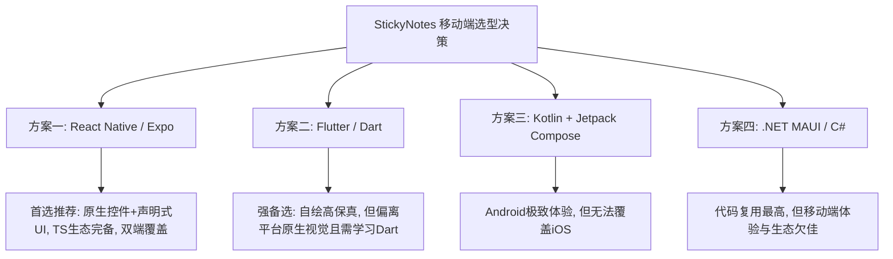
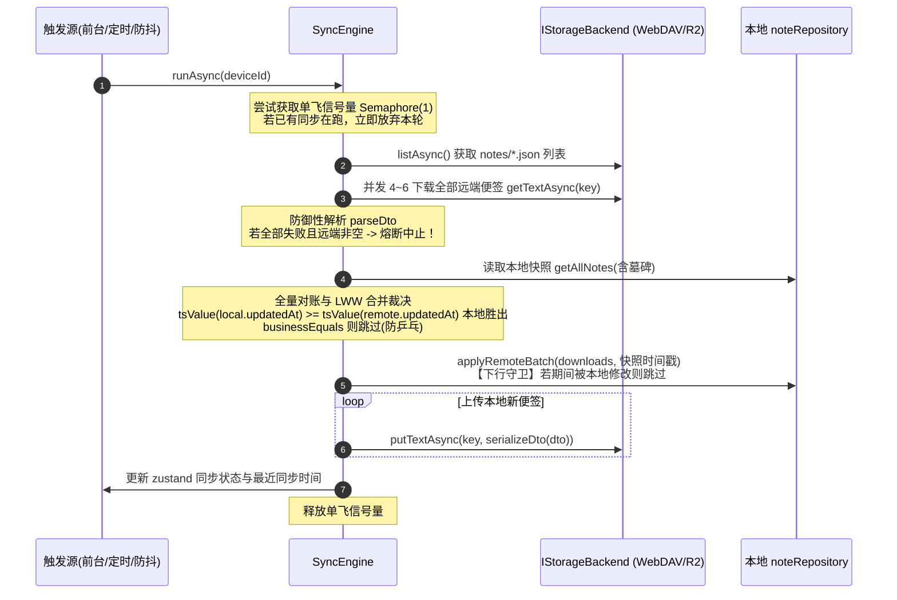

# StickyNotes 移动端 / 跨平台 App 架构与实现方案 (GFH)

> **文档版本**：v1.1.0  
> **文档代号**：`GFH`  
> **创建日期**：2026-10-04 (GMT+8)  
> **修订日期**：2026-10-04 (GMT+8) — v1.1.0 选型结论由 Flutter 变更为 **React Native / Expo**：移动端视觉目标由"像素级还原桌面端"改为"遵循平台原生设计规范"，7 色主题仅作用于便签卡片本身；同步协议与数据契约不变。  
> **关联项目**：原桌面端 [`StickyNotesDesktop`](file:///C:/Home/Projects/StickyNotesDesktop)  
> **核心协议**：[`SYNC-PROTOCOL-DESIGN-20261004.md`](file:///C:/Home/Projects/StickyNotesDesktop/docs/SYNC-PROTOCOL-DESIGN-20261004.md)  
> **视觉参考**：[`StickyNotesDesktop/temp/screenshots/`](file:///C:/Home/Projects/StickyNotesDesktop/temp/screenshots)

---

## 一、项目背景与定位

### 1.1 业务诉求
原桌面端项目 `StickyNotesDesktop` 是一款面向 Windows 10/11 的极简、纯离线、高可靠的彩色桌面便签软件，目前已成功落地并验证了**便签网络同步协议 v1**（基于 WebDAV 与 Cloudflare R2 / S3 兼容双存储后端，采用文件即协议与无状态全量对账架构）。

本项目为 StickyNotes 的**移动版 / 跨平台版**，旨在让用户在手机或平板移动设备上随手记录灵感与待办，并能与桌面端实现**双向无缝、数据零丢失的便签同步**。

### 1.2 视觉设计原则
- 移动端**遵循平台原生设计规范**：Android 端对齐 Material 3，iOS 端对齐 Human Interface Guidelines（导航、工具栏、对话框、开关等系统级控件直接使用平台默认样式）。
- **经典 7 色主题仅作用于便签卡片本身**（背景/工具条/文本/边框），属于便签内容属性而非应用外观属性，必须与桌面端色值完全一致；应用外壳（导航栏、设置页等）跟随平台视觉。
- 不追求与桌面端像素级一致，桌面端视觉仅作布局与信息架构参考。

### 1.3 功能裁剪与边界定义（移动端视角的克制）
移动端应用**不需要**照搬桌面端的全部桌面特化属性，而是针对触屏手势和移动场景进行克制裁剪：

| 功能模块 | 移动端处理策略 | 裁剪/保留理由 |
|---|---|---|
| **便签列表管理（主界面）** | **必须保留** | 核心浏览与检索入口。支持卡片流/网格展示、便签标题与预览、置顶过滤、实时搜索、新建、归档。 |
| **便签详情与编辑页** | **必须保留** | 核心创作场景。纯文本流畅输入、7 种经典主题色彩切换、置顶状态切换、软删除（归档）、字数统计与同步状态指示。 |
| **设置与同步设置** | **必须保留** | 核心配置项。支持主题切换（浅色/深色/跟随系统）、字号调整；同步设置完整保留桌面端能力（后端选型、服务器地址/凭据、测试连接、立即同步、状态统计）。 |
| **已归档便签箱** | **保留** | 方便用户查看已删除便签、恢复误删便签或清空回收站。 |
| **独立桌面悬浮贴纸** | **明确排除** | 移动端受限于移动操作系统沙盒与窗口机制，无法随处悬浮置顶，采用标准移动页导航与卡片流。 |
| **无边框窗口八向拖拽缩放** | **明确排除** | 纯桌面键鼠交互属性。 |
| **屏幕绝对坐标记忆 (X/Y/W/H)** | **忽略但不破坏** | 移动端不感知窗口坐标；协议下行时保持本地默认落点，上行时原样携带（或不修改），避免冲掉桌面端的排版。 |
| **桌面系统托盘 / 全局热键** | **明确排除** | 移动端无托盘与全局按键机制。 |
| **开机自启 / 开机最小化** | **明确排除** | 移动端对应系统级的后台任务调度。 |

---

## 二、数据契约与协议规范对齐

为了保证与桌面端无缝协同，移动端必须 100% 遵照桌面端已落地的协议设计与数据模型规范。

### 2.1 经典 7 色主题色板规范（仅作用于便签卡片）
移动端便签卡片在视觉上必须与桌面端完全一致，保持柔和、护眼且高辨识度的卡片质感：

| 主题色枚举 (`color`) | 背景色 (`Background`) | 标题/工具条 (`Toolbar`) | 文本色 (`Text`) | 边框色 (`Border`) | 强调色 (`Accent`) | 次级文本 (`Secondary`) |
|:---|:---:|:---:|:---:|:---:|:---:|:---:|
| **`yellow`** (默认) | `#FFF7D1` | `#FFEE9D` | `#202020` | `#E6D77D` | `#E0A800` | `#6C6546` |
| **`green`** | `#E4F9E0` | `#C8F2C2` | `#202020` | `#BCE5B6` | `#209E35` | `#476A42` |
| **`pink`** | `#FFE4EF` | `#FFC7DE` | `#202020` | `#F5BCCE` | `#DB3374` | `#774457` |
| **`purple`** | `#F2E6FF` | `#E4CCFF` | `#202020` | `#D5BAFA` | `#7F3CD8` | `#594575` |
| **`blue`** | `#E1F3FE` | `#C3E8FD` | `#202020` | `#B7DAF5` | `#1079D1` | `#425C70` |
| **`gray`** | `#F6F6F8` | `#E8E8EB` | `#202020` | `#DCDCE0` | `#636366` | `#616166` |
| **`charcoal`** (暗黑) | `#292929` | `#1E1E1E` | `#F5F5F5` | `#3D3D3D` | `#4CC2FF` | `#A6A6A6` |

### 2.2 便签文件 Wire 格式 (JSON Schema v1)
远端对象统一为 `<根>/notes/<小写Guid>.json`，单文件 UTF-8 无 BOM，格式严格如下：

```json
{
  "schemaVersion": 1,
  "id": "9f3c8a4e-1b2d-4c3e-a5f6-0123456789ab",
  "content": "便签正文（纯文本，\\n 换行）",
  "color": "yellow",
  "isPinnedInList": false,
  "alwaysOnTop": false,
  "isDeleted": false,
  "createdAt": "2026-10-04T03:00:00.0000000Z",
  "updatedAt": "2026-10-04T07:30:00.0000000Z",
  "deviceId": "android-a7b3cd"
}
```

### 2.3 移动端必须严格遵照的 8 大同步铁律
1. **换行符规范化**：DTO 序列化与比对时，所有换行符统一规范化为 `\n`（禁止出现 `\r\n` 导致的虚假内容差异与死循环推送）。
2. **时间戳精度与格式**：全链路采用 ISO-8601 UTC round-trip 格式（含 `.0000000Z`），禁止把无时区时间戳解释为本地时间。**JS 端特别注意**：时间戳在 DTO、本地库、远端文件中一律以原始字符串形式携带，仅在 LWW 裁决时解析比较（`Date.parse` 毫秒精度足够，亚毫秒截断由"相等时本地胜出"规则兜底）。
3. **LWW 裁决规则**：`local.UpdatedAt >= remote.UpdatedAt` 时本地胜出（相等且内容不同时本地胜出）。
4. **防乒乓传输**：仅当业务内容（`Content`, `Color`, `IsPinnedInList`, `AlwaysOnTop`, `IsDeleted`）与远端存在实际差异时才执行 PUT。
5. **时间戳不回填**：若两端内容相同但时间戳不同，两端均不执行传输，各自保留本地时间戳。
6. **下行写守卫（Guard）**：下行入库必须采用单事务条件更新，仅覆盖"读取快照后未被本地修改"的便签；若快照后被本地编辑则跳过下行，下一轮自动重算。
7. **全失败熔断防护**：远端列表非空但所有 GET 均失败时，**绝不允许**当作远端为空而执行清空或覆盖回传，必须立即中止本轮。
8. **凭据安全与隐私**：密码与密钥不得明文落盘，必须经由操作系统级安全硬件保护（Android Keystore / iOS Keychain）；同步日志绝对禁止打印便签正文。

---

## 三、跨平台与移动端候选技术方案对比

针对移动端实现，我们评估了四种主流架构路线。**选型前提已明确**：移动端遵循平台原生视觉、不追求自绘像素级一致，且维护者具备 TypeScript/JavaScript 与 Web 前端背景，界面以声明式方式开发效率最高。



### 3.1 方案一：React Native / Expo (TypeScript) —— 【首选推荐方案】
- **技术栈**：React Native 0.8x（New Architecture 默认启用，JSI 直调原生模块，无旧桥接开销）+ Expo SDK + TypeScript (strict)
- **导航**：`expo-router`（文件约定式路由）
- **本地存储**：`expo-sqlite`（打开后执行 `PRAGMA journal_mode=WAL`；以薄封装提供强类型 Repository）
- **网络与加密**：`fetch` 处理 WebDAV；`@noble/hashes`（纯 TypeScript、体积极小、经广泛审计）实现 HMAC-SHA256 最小 SigV4 签名器（约 100 行）；`fast-xml-parser` 解析 PROPFIND multistatus
- **安全存储**：`expo-secure-store`（集成 Android Keystore 与 iOS Keychain）
- **后台任务**：`expo-background-task` + `expo-task-manager`（Android 底层即 WorkManager，15 分钟为法定最小周期）
- **状态管理**：`zustand`（轻量、无样板代码）
- **列表性能**：`@shopify/flash-list`（千级便签卡片流无压力）

#### 优点：
1. **原生平台视觉天然达成**：RN 渲染的是**真正的原生控件**（Android 上是 Material 组件，iOS 上是 UIKit 组件），导航、工具栏、对话框、开关、深色模式跟随系统——与本项目"遵循平台原生设计规范"的目标完全同向，无需任何额外成本。
2. **界面开发效率最高**：JSX 声明式 UI + StyleSheet/inline style + 热更新（Fast Refresh），列表、表单、弹层的编写速度显著快于 Dart/C#/Kotlin；维护者的 Web 技术栈背景可直接复用，语言学习成本为零。
3. **双端一次覆盖**：一套 TypeScript 代码同时构建 Android 与 iOS，Expo EAS Build 还提供云打包，免配置本地 iOS 构建环境。
4. **同步协议层移植成本经实证可控**：桌面端同步层（`SyncEngine.cs` 201 行、`WebDavBackend.cs` 288 行、`S3Backend.cs` 268 行、`SigV4Signer.cs` 116 行、`SyncModels.cs` 200 行）合计约 **1200 行**纯 C#（无 WPF 依赖，仅引用 `StickyNotes.Data/Infrastructure` 两个内部层），另有约 1000 行单测可**直接翻译为 jest/vitest 测试向量**作为验收标准。TS 生态的 `@noble/hashes`、`fast-xml-parser` 完全覆盖 SigV4 与 PROPFIND XML 需求。
5. **时间戳方案清晰**：协议时间戳全链路按原始字符串携带（DTO/SQLite/远端文件），仅在 LWW 比较时 `Date.parse`，精度规则由铁律 2 明确约束，无隐形坑。

#### 缺点：
1. 安装包体积约 15MB~20MB（Hermes 引擎与 RN 运行时），与 Flutter 同级，明显大于原生。
2. 便签卡片是自绘样式的 View（非系统控件），在极少数深度定制 ROM 上圆角/阴影渲染细节可能存在细微差异；但这属于便签**内容**呈现，可接受。
3. RN 大版本升级与第三方库兼容性存在偶发维护成本（Expo 托管工作流可大幅缓解）。
4. 后台定时同步在国内定制 ROM 上仍可能被杀后台，需引导用户配置省电白名单（此点对所有非系统应用均成立）。

### 3.2 方案二：Flutter (Dart) —— 【高保真强备选方案】
- **技术栈**：Flutter 3.x + Dart 3.x
- **本地存储**：`drift`（基于 SQLite 的强类型响应式框架）
- **网络与加密**：`http` 处理 WebDAV；`crypto` 包手写最小 SigV4 签名器
- **安全存储**：`flutter_secure_storage`
- **后台任务**：`workmanager`

#### 优点：
1. **自绘引擎像素级一致**：Impeller/Skia 完全摆脱系统控件差异，若未来需要"7 色卡片在所有设备 100% 一致"的强视觉要求，Flutter 是唯一稳妥路线。
2. 多端覆盖能力强，性能优异，Dart 适合写底层网络协议代码。

#### 缺点：
1. **自绘与本项目的"平台原生视觉"目标相悖**：应用外壳需手动模拟 Material/iOS 风格，手势回弹、对话框动效等细节永远"像但不是"原生，维护成本反而更高。
2. Dart 语言学习成本：对 TS/JS 背景的维护者是从零学习。
3. 空包体积约 15MB~20MB。

#### 适用场景：
如果未来产品方向改变，要求移动端与桌面端**像素级统一的自定义视觉**，则应切换回 Flutter。

### 3.3 方案三：Android 原生 (Kotlin + Jetpack Compose) —— 【单平台极致方案】
- **技术栈**：Kotlin + Jetpack Compose + Material 3
- **本地存储**：`Room`；**网络**：`OkHttp` + `kotlinx.serialization` + 手写 SigV4
- **安全存储**：Android Keystore + DataStore（注：Jetpack Security 的 `EncryptedSharedPreferences` 已被 Google 官方废弃，不应采用）
- **后台同步**：原生 `WorkManager`

#### 优点：APK 最小（5~8MB）、冷启动毫秒级、WorkManager 保活成功率最高、与 Android 系统整合度最高。
#### 缺点：
1. **无法覆盖 iOS**，未来扩展必须用 Swift 全量重写。
2. 协议层需 Kotlin 全量重写，且维护者需学习 Kotlin/Compose。

#### 适用场景：若明确承诺永远只做 Android 且追求极限小包。

### 3.4 方案四：.NET MAUI (C#) —— 【C# 团队专用方案】
- **技术栈**：.NET MAUI (.NET 8/9) + C#
- **本地存储**：`Microsoft.Data.Sqlite`；**安全存储**：MAUI `SecureStorage`

#### 优点：
1. **核心逻辑复用率最高**：桌面端同步层约 1200 行 C# 与约 1000 行单测几乎原样可用。**实证修正**：该层虽无 WPF 依赖，但引用了 `StickyNotes.Data` 与 `StickyNotes.Infrastructure` 两个内部项目，"零改复用"需要先做一层依赖剥离，属一天内的重构工作。

#### 缺点：
1. Android 冷启动 1.5s~2.5s，原生控件包裹模式在 OEM ROM 上边框/圆角/投影渲染踩坑多。
2. 移动端生态活跃度低，遇到机型特性坑时社区案例少。
3. 对 TS/JS 背景的维护者需学习 C#/XAML 与 MAUI 体系。

#### 适用场景：如果开发团队完全由 C# 桌面开发者构成且需最快出原型。

### 3.5 四大方案综合选型矩阵（按 v1.1 选型前提重新校准）

评估维度已按新前提调整：删除"像素级 UI 一致性"，新增"平台原生视觉"与"界面开发效率"；"代码复用"权重下调（实证移植成本可控）。

| 评估维度 (权重) | 方案一：React Native | 方案二：Flutter | 方案三：原生 Android | 方案四：.NET MAUI |
|---|:---:|:---:|:---:|:---:|
| **多平台覆盖 (iOS+Android)** (20%) | ★★★★☆ (4) | ★★★★★ (5) | ★☆☆☆☆ (1) | ★★★★☆ (4) |
| **平台原生视觉一致性** (15%) | ★★★★☆ (4) | ★★☆☆☆ (2) | ★★★★★ (5) | ★★★☆☆ (3) |
| **界面开发效率（声明式 UI / 团队技术栈匹配）** (15%) | ★★★★★ (5) | ★★★☆☆ (3) | ★★★☆☆ (3) | ★★★☆☆ (3) |
| **冷启动与运行流畅度** (10%) | ★★★★☆ (4) | ★★★★☆ (4) | ★★★★★ (5) | ★★☆☆☆ (2) |
| **协议层移植成本 / 代码复用** (10%) | ★★★☆☆ (3) | ★★★☆☆ (3) | ★★☆☆☆ (2) | ★★★★★ (5) |
| **安装包轻量度 (APK 体积)** (10%) | ★★☆☆☆ (2) | ★★★☆☆ (3) | ★★★★★ (5) | ★★☆☆☆ (2) |
| **移动端生态成熟度** (10%) | ★★★★☆ (4) | ★★★★★ (5) | ★★★★★ (5) | ★★☆☆☆ (2) |
| **协议自愈与持久化可靠性** (10%) | ★★★★☆ (4) | ★★★★★ (5) | ★★★★★ (5) | ★★★★★ (5) |
| **综合加权得分** | **3.85** | **3.75** | **3.60** | **3.30** |

### 3.6 取舍理由与最终选型结论

1. **为什么首选 React Native / Expo？**
   - 本项目移动端明确**遵循平台原生设计规范**，RN 渲染真实原生控件，目标零成本达成；自绘引擎方案（Flutter）反而与此目标相悖。
   - 维护者具备 TypeScript/Web 背景，**JSX 声明式界面开发效率最高、语言学习成本为零**，个人项目交付速度是第一优先级。
   - 同步协议层移植经实证仅约 1200 行核心代码，TS 生态有轻量且可靠的对应库（`@noble/hashes`、`fast-xml-parser`），配合桌面端约 1000 行单测向量翻译，协议正确性有硬验收标准。
   - 一套代码覆盖 Android + iOS，Expo 托管工作流（EAS Build / OTA 更新）进一步降低构建与发版负担。

2. **备选方案的逃生场景**：
   - **如果未来重新要求便签卡片与应用外壳全部像素级统一的自定义视觉**：切换 **Flutter**。
   - **如果明确承诺 100% 永远不考虑 iOS，且追求极限小包（<8MB）与毫秒级冷启动**：选用 **原生 Android (Kotlin + Jetpack Compose)**。
   - **如果维护团队完全由 C# 桌面开发者构成**：选用 **.NET MAUI**（需先做同步层依赖剥离）。

---

## 四、首选方案（React Native / Expo）完整工程落地架构设计

下面针对推荐的 **React Native / Expo** 方案，给出详尽的代码级架构设计与落地蓝图。

### 4.1 总体架构分层

```mermaid
graph TD
    subgraph UI_Layer [View 层: React 组件 + expo-router 路由]
        HomeView[便签列表页 app/index]
        EditView[便签编辑页 app/note/[id]]
        ArchiveView[已归档便签页 app/archive]
        SettingsView[系统设置页 app/settings]
        SyncSettingsView[同步配置页 app/settings/sync]
    end

    subgraph State_Layer [状态管理层: zustand]
        NotesStore[便签状态 notesStore]
        SyncStore[同步状态 syncStore]
        SettingsStore[配置状态 settingsStore]
    end

    subgraph Domain_Layer [领域业务层: services]
        SyncEngine[同步对账引擎 SyncEngine]
        SearchService[搜索高亮与首命中提取服务]
        AutoSaveCoordinator[自动保存与下行防抖协调器]
    end

    subgraph Backend_Layer [网络与存储抽象: sync/backends]
        IStorageBackend[存储接口 IStorageBackend]
        WebDavBackend[WebDAV 实现: PROPFIND/GET/PUT/DELETE]
        S3Backend[Cloudflare R2 实现: 手写 SigV4 + S3 API]
    end

    subgraph Data_Layer [持久化基础设施: data]
        NoteRepository[便签仓储 noteRepository]
        AppDatabase[expo-sqlite WAL 模式]
        SecureStorage[expo-secure-store 安全存储]
        BackgroundTask[expo-background-task 定时同步调度]
    end

    HomeView --> NotesStore
    EditView --> NotesStore
    ArchiveView --> NotesStore
    SettingsView --> SettingsStore
    SyncSettingsView --> SyncStore

    NotesStore --> NoteRepository
    NotesStore --> AutoSaveCoordinator
    SyncStore --> SyncEngine

    SyncEngine --> IStorageBackend
    SyncEngine --> NoteRepository
    IStorageBackend --> WebDavBackend
    IStorageBackend --> S3Backend

    NoteRepository --> AppDatabase
    SyncStore --> SecureStorage
    BackgroundTask --> SyncEngine
```

---

### 4.2 核心界面与交互规范

**总原则**：导航结构、工具栏、对话框、开关、下拉菜单等一律使用平台原生样式（React Native 原生组件 + `Platform.select` 区分 Android Material 3 / iOS HIG 行为）；7 色主题仅用于便签卡片的背景/工具条/文本/边框。

#### 1. 主界面（便签列表管理中心）
- **顶部导航栏**：使用平台标准 Top App Bar（Android）/ Large Title Navigation Bar（iOS）。
  - 左侧：StickyNotes 贴纸黄色图标 + 标题"便签"。
  - 右侧操作项：
    - `[归档箱]` 图标：进入已归档便签管理页。
    - `[设置]` 图标：进入设置页。
    - 同步状态指示：微型云朵图标（已同步绿点 / 同步中转圈 / 异常红点）。
- **快捷搜索框**：
  - 平台标准搜索控件（Android `SearchBar` / iOS `UISearchController` 风格），带清除按钮，占位符：`搜索便签内容...`。
  - 即输即搜（300ms 防抖），卡片中高亮匹配文本片段（`Text` 嵌套 span 渲染）。
- **分类过滤 Chips**：
  - `全部 (N)`、`已置顶 (N)` 横向胶囊切换。
- **便签卡片流（`@shopify/flash-list`，masonry 多列瀑布流）**：
  - 便签卡片背景/工具条/边框取自 §2.1 七色主题表（内容属性，与桌面端完全一致）。
  - 卡片内容：
    - 首行非空文字加粗提取为标题（最长 40 字，超出省略号）。
    - 2~4 行正文预览。
    - 右上角：置顶图钉图标（若 `isPinnedInList=true`）及更多菜单 `···`（置顶/取消置顶、归档）。
    - 底部信息条：字符数统计（如 `72 字符`）及相对时间（如 `刚刚`、`30 分钟前`、`昨天 18:57`）。
- **浮动操作按钮 (FAB)**：
  - 右下角 Material `FAB`（Android）/ 平台等效样式（iOS），点击进入便签编辑页。
- **手势交互**：
  - 下拉刷新（`RefreshControl`，平台原生回弹/动画）：手动触发一轮 `SyncEngine.runAsync()`。
  - 卡片左滑：快速归档/删除（带确认与撤销 Snackbar/Toast）。

#### 2. 便签详情与编辑页
- **纯粹无干扰编辑**：
  - 顶部极窄工具栏，背景采用对应主题色中的工具条色（`Toolbar`）。
  - 左侧：`[返回]` 键（退出时立即 Flush 保存）。
  - 右侧快捷工具：
    - `[📌 置顶]` 图标：一键切换在列表中置顶。
    - `[🎨 调色板]` 图标：底部弹出 7 色主题选择面板（圆形色块，带选中对勾），点击即时切换卡片底色。
    - `[··· 更多]` 菜单：包含"归档便签"、"放弃更改"。
- **正文编辑区**：
  - 全屏多行 `TextInput`（`multiline`），自适应软键盘弹出（`KeyboardAvoidingView` + 平台行为差异处理）。
  - 背景色完全沉浸在便签的柔和背景色中。
  - 字体大小根据用户设置缩放。
- **底部状态栏**：
  - 左侧：当前字符数统计（实时计算）。
  - 右侧：同步状态标签（`已同步` / `保存中...` / `未同步`）。
- **保存策略**：
  - 输入停止 500ms 后静默防抖持久化至 SQLite，并记录更新时间。
  - 页面返回、进入后台（`AppState` 监听）时无延迟无条件刷盘。

#### 3. 设置与同步设置页
布局与信息架构参考桌面端 `09_SettingsWindow.png` 和 `09b_SyncSettingsWindow.png`，控件全部采用平台原生样式：
- **外观与显示**：
  - 主题切换：跟系统 / 浅色模式 / 深色模式。
  - 正文字号：小 (12pt) / 标准 (14pt - 默认) / 大 (16pt) / 超大 (18pt)，带实时预览卡片。
- **网络同步（核心分区）**：
  - **启用网络同步** 开关。
  - **存储后端** 选择器：`WebDAV` / `Cloudflare R2`。
  - **WebDAV 配置区**（当选择 WebDAV 时展示）：
    - 服务器地址：`https://...`（附带格式说明，如坚果云、Nextcloud 路径）。
    - 用户名：输入框。
    - 密码 / 应用专用密码：安全输入框。
    - 允许明文 HTTP（仅限内网 NAS）开关（带黄色警告文案）。
  - **Cloudflare R2 / S3 配置区**（当选择 R2 时展示）：
    - Endpoint：`https://<ACCOUNT_ID>.r2.cloudflarestorage.com`
    - Bucket 桶名、BasePrefix（如 `stickynotes/`，默认填好）。
    - AccessKey ID 与 Secret Access Key（安全输入框）。
  - **后台同步间隔**：选择器（5 分钟、10 分钟、15 分钟(默认)、30 分钟、60 分钟）。
  - **操作控制**：
    - `[测试连接]` 按钮：调用 `IStorageBackend.testAsync()`，弹窗或状态文本反馈结果（连通耗时 / 错误详情）。
    - `[立即同步]` 按钮：手动触发同步，展示旋转指示器。
  - **状态与诊断信息**：
    - 同步状态（已启用/未启用/同步中/同步失败）。
    - 最近一次成功同步时间。
    - 上次错误摘要（网络超时/认证失败等，红灰色）。
    - 本机设备标识展示（如 `android-8xf7ad`，首启生成且持久化）。
- **关于应用**：
  - 应用图标与版本号（`v1.0.0`）、同步协议版本 (`v1.2`)、开源声明。

---

### 4.3 核心数据结构与存储定义 (TypeScript)

#### 1. 便签核心实体
```typescript
export const NOTE_COLORS = ['yellow', 'green', 'pink', 'purple', 'blue', 'gray', 'charcoal'] as const;
export type NoteColor = (typeof NOTE_COLORS)[number];

export function noteColorFromString(val: string): NoteColor {
  const lower = val.toLowerCase();
  return (NOTE_COLORS as readonly string[]).includes(lower)
    ? (lower as NoteColor)
    : 'yellow';
}

export interface Note {
  id: string;              // UUID 小写 36 字符
  content: string;         // 一律 \n 换行
  color: NoteColor;
  isPinnedInList: boolean;
  alwaysOnTop: boolean;    // 移动端不生效，但同步保留字段
  isDeleted: boolean;
  createdAt: string;       // ISO-8601 UTC 原始字符串
  updatedAt: string;       // ISO-8601 UTC 原始字符串
}

const EMPTY_TITLE = '（空白便签）';

export function displayTitle(content: string): string {
  for (const line of content.split('\n')) {
    const t = line.trim();
    if (t) return t.length <= 40 ? t : t.slice(0, 40) + '...';
  }
  return EMPTY_TITLE;
}

export function previewText(content: string): string {
  const t = content.trim();
  return t === '' ? EMPTY_TITLE : t;
}
```

#### 2. 同步 DTO 与序列化 (严格遵循 Schema v1)
```typescript
const NEWLINE_RE = /\r\n|\r/g;
export const normalizeNewlines = (s: string): string => s.replace(NEWLINE_RE, '\n');

export interface SyncNoteDto {
  schemaVersion: number;   // 固定 1
  id: string;              // 小写 UUID
  content: string;
  color: string;
  isPinnedInList: boolean;
  alwaysOnTop: boolean;
  isDeleted: boolean;
  createdAt: string;       // 严格 ISO-8601 UTC 原始字符串
  updatedAt: string;       // 严格 ISO-8601 UTC 原始字符串
  deviceId?: string;
}

export function serializeDto(dto: SyncNoteDto): string {
  const body = {
    schemaVersion: dto.schemaVersion,
    id: dto.id,
    content: normalizeNewlines(dto.content),
    color: dto.color,
    isPinnedInList: dto.isPinnedInList,
    alwaysOnTop: dto.alwaysOnTop,
    isDeleted: dto.isDeleted,
    createdAt: dto.createdAt,
    updatedAt: dto.updatedAt,
    ...(dto.deviceId ? { deviceId: dto.deviceId } : {}),
  };
  return JSON.stringify(body);
}

/** 防御性解析：任何字段非法均返回 null，由引擎跳过该文件 */
export function parseDto(jsonText: string, expectedKey?: string): SyncNoteDto | null {
  try {
    const json = JSON.parse(jsonText) as Record<string, unknown>;
    const v = typeof json['schemaVersion'] === 'number' ? json['schemaVersion'] : 1;
    if (v > 1) return null; // 陌生高版本忽略

    const id = typeof json['id'] === 'string' ? json['id'].toLowerCase() : '';
    if (!id) return null;
    if (expectedKey && expectedKey.toLowerCase() !== `notes/${id}.json`) {
      return null; // ID 与文件名不一致防护
    }

    return {
      schemaVersion: v,
      id,
      content: normalizeNewlines(typeof json['content'] === 'string' ? json['content'] : ''),
      color: (typeof json['color'] === 'string' ? json['color'] : 'yellow').toLowerCase(),
      isPinnedInList: json['isPinnedInList'] === true,
      alwaysOnTop: json['alwaysOnTop'] === true,
      isDeleted: json['isDeleted'] === true,
      createdAt: typeof json['createdAt'] === 'string' ? json['createdAt'] : '',
      updatedAt: typeof json['updatedAt'] === 'string' ? json['updatedAt'] : '',
      deviceId: typeof json['deviceId'] === 'string' ? json['deviceId'] : undefined,
    };
  } catch {
    return null;
  }
}

/** LWW 时间比较：毫秒精度，非法字符串视为最早（0） */
export function tsValue(iso: string): number {
  const t = Date.parse(iso);
  return Number.isNaN(t) ? 0 : t;
}

export function businessEquals(a: SyncNoteDto, b: SyncNoteDto): boolean {
  return (
    normalizeNewlines(a.content) === normalizeNewlines(b.content) &&
    a.color === b.color &&
    a.isPinnedInList === b.isPinnedInList &&
    a.alwaysOnTop === b.alwaysOnTop &&
    a.isDeleted === b.isDeleted
  );
}
```

---

### 4.4 存储后端抽象与轻量实现

#### 1. `IStorageBackend` 接口定义
```typescript
export interface RemoteItem {
  key: string;
  size?: number;
  lastModified?: string; // ISO-8601 原始字符串
}

export interface IStorageBackend {
  listAsync(): Promise<RemoteItem[]>;
  getTextAsync(key: string): Promise<string | null>;
  putTextAsync(key: string, content: string): Promise<void>;
  deleteAsync(key: string): Promise<void>;
  testAsync(): Promise<void>;
  dispose(): void;
}
```

#### 2. Cloudflare R2 / S3 最小 SigV4 签名器
避免引入 AWS SDK，采用 `@noble/hashes`（纯 TS 的 sha256/hmac）编写约 100 行签名器：
- 签名算法：HMAC-SHA256（`@noble/hashes/sha2` 的 `hmac`）
- 头清单：`host;x-amz-content-sha256;x-amz-date`
- Region 固定：`auto`，Service 固定：`s3`
- 支持 `ListObjectsV2`、`GetObject`、`PutObject`、`DeleteObject` 的标准 AWS Authorization 标头。
- 正确性验收：以 AWS 官方 SigV4 测试向量跑 jest 单测（对照桌面端 `SigV4SignerTests.cs` 翻译）。

#### 3. WebDAV 客户端实现
- 基于 `fetch`，支持 Basic 认证。
- `PROPFIND` Depth 1 的 `207 Multi-Status` XML 用 `fast-xml-parser` 解析，提取 `d:href`、`d:getlastmodified`。
- 遇 404 自动触发 `MKCOL` 递归自举创建 `notes/` 目录。

---

### 4.5 同步引擎 (SyncEngine) 完整工作流



---

### 4.6 后台定时同步与生命周期设计

在移动端环境中，同步触发需要结合系统特性：
1. **应用唤醒与切前台**：使用 React Native `AppState` 监听，状态变为 `active` 时延迟 2 秒自动发起一轮对账同步（捕获用户在电脑端编辑后的下行数据）。
2. **编辑防抖触发**：用户在手机上新建或编辑便签，输入停止 500ms 后保存本地 SQLite，同时触发同步倒计时防抖 **5 秒**，静默上行到云端。
3. **删除/归档触发**：本地归档后防抖 **2 秒** 快速同步墓碑文件。
4. **后台定时任务**：
   - 使用 `expo-background-task` 注册周期任务（Android 底层为 WorkManager），设置间隔为 15 分钟（WorkManager 法定最小间隔，两者天然契合）。
   - 网络约束设置为仅在有网络时唤醒。
   - 在后台任务中实例化无 UI 的 `SyncEngine` 执行一轮对账，执行完毕即刻释放资源。
   - 在国内深度定制 ROM 上被杀后台时，引导用户配置省电白名单（应用内设置页提供跳转引导）。

---

### 4.7 项目工程目录结构规划

```
StickyNotesApp/
├── app/                          # expo-router 文件约定式路由
│   ├── _layout.tsx               # 根布局, 主题 Provider 与全局初始化
│   ├── index.tsx                 # 便签列表主界面 (搜索栏, Chips, 卡片流, FAB)
│   ├── note/[id].tsx             # 便签编辑页 (含 new 新建分支)
│   ├── archive.tsx               # 已归档便签管理页
│   └── settings/
│       ├── index.tsx             # 设置页 (外观与显示, 关于)
│       └── sync.tsx              # 同步设置页 (WebDAV/R2, 测试连接, 立即同步)
├── src/
│   ├── components/               # NoteCard, SearchBar, ColorPalette, SyncBadge...
│   ├── stores/                   # zustand: notesStore, syncStore, settingsStore
│   ├── sync/
│   │   ├── backends/             # IStorageBackend, WebDavBackend, S3Backend
│   │   ├── crypto/sigv4.ts       # 最小 SigV4 签名器 (@noble/hashes)
│   │   ├── dto.ts                # SyncNoteDto 序列化与防御性解析
│   │   ├── engine.ts             # SyncEngine 核心对账算法与单飞锁
│   │   ├── settings.ts           # SyncSettings 持久化 (非敏感部分)
│   │   └── scheduler.ts          # expo-background-task 周期任务注册
│   ├── data/
│   │   ├── db.ts                 # expo-sqlite 初始化, WAL, 迁移脚本
│   │   ├── noteRepository.ts     # 增删改查, 守卫批量更新
│   │   └── theme.ts              # 7 色主题色值常量 (与 §2.1 一一对应)
│   └── services/
│       ├── autoSave.ts           # 500ms 防抖保存协调器
│       ├── credential.ts         # expo-secure-store (Keystore/Keychain)
│       └── search.ts             # 实时搜索与关键词定位
├── __tests__/
│   ├── syncEngine.test.ts        # 同步对账与 LWW 核心算法单测
│   ├── sigv4.test.ts             # AWS 官方向量校验单测
│   └── protocol.test.ts          # Schema 校验与防乒乓测试
├── app.json                      # Expo 配置 (权限, 图标, 启动屏)
├── eas.json                      # EAS Build 构建配置
└── package.json
```

---

## 五、实施里程碑与落地步骤 (Roadmap)

| 阶段 | 目标与产出 | 核心验收标准 |
|---|---|---|
| **Phase 1：基础脚手架与本地 CRUD** | 搭建 Expo 工程，配置 expo-sqlite，实现便签本地新建、编辑、7 色切换、列表展示与实时搜索。 | 离线增删改查流畅，500ms 防抖保存稳定，7 色便签卡片渲染与桌面端色值完全一致。 |
| **Phase 2：同步协议层移植与单测** | 实现 `SyncNoteDto`、`WebDavBackend`、`S3Backend`（SigV4）以及 `SyncEngine`。 | 跑通与桌面端完全一致的单测向量（LWW 规则、墓碑传播、防乒乓、坏文件跳过、全失败熔断、SigV4 官方向量）。 |
| **Phase 3：同步 UI 与全链路联调** | 完成设置页与同步设置页开发，支持 WebDAV / R2 参数配置与凭据安全存储，接通"测试连接"与"立即同步"。 | 与原桌面端应用在同一个坚果云/R2 桶内进行双向互相同步测试，新建、编辑、删除完全收敛。 |
| **Phase 4：后台调度与完善** | 接入 expo-background-task 后台同步，优化弱网离线提示，完善关于页与版本打包（EAS Build 导出 Android APK/AAB）。 | 锁屏/后台可自动静默同步，无崩溃无内存泄露。 |

---

## 六、总结

本项目推荐采用 **React Native / Expo (TypeScript)** 作为跨平台实现方案，其核心价值在于：
1. **原生平台视觉零成本达成**：真实原生控件天然对齐 Material 3 / iOS HIG 与系统深色模式，与本项目"遵循平台原生设计"的定位完全同向；7 色主题精确作用于便签卡片本身，保持与桌面端一致的辨识度。
2. **最高交付效率**：维护者的 TypeScript/Web 技术栈零学习成本，JSX 声明式 UI 与 Expo 托管工作流（EAS Build、Fast Refresh）使界面迭代最快。
3. **协议正确性有硬保障**：通过手写极简 SigV4 签名器（`@noble/hashes`）、标准 WebDAV 动词封装，以及桌面端约 1000 行同步单测向量的直接翻译验收，能以极高标准贯彻执行《便签网络同步协议 v1》的各项严苛指标，确保数据坚如磐石、永不丢失。
4. **保留逃生通道**：若未来产品要求像素级统一的自定义视觉，可评估切换 Flutter；同步协议层与存储后端设计均为语言无关，迁移成本可控。
